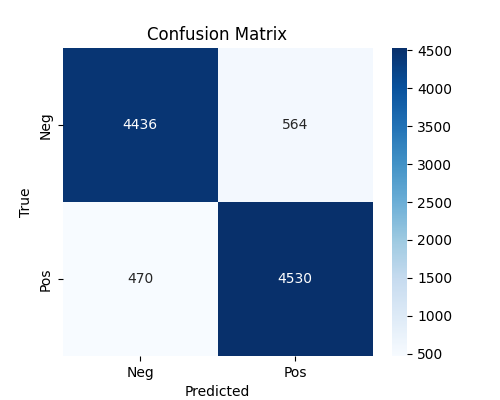
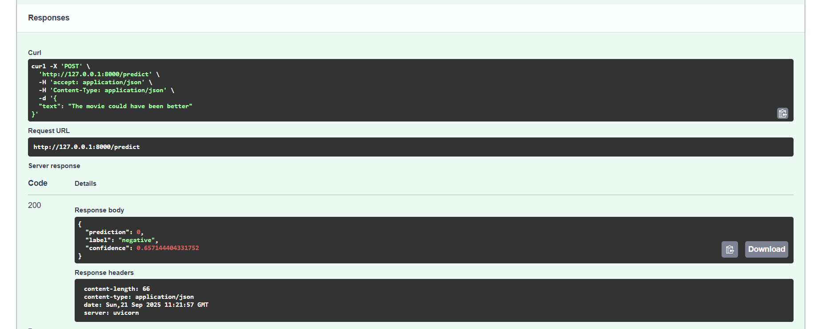

# 🎬 IMDB Sentiment Analysis (MLOps Project)

This repository contains an **end-to-end machine learning pipeline** for **IMDB Movie Reviews Sentiment Analysis**.  
We use a simple but effective **TF-IDF + Logistic Regression** model, and integrate **MLOps tools** for reproducibility, tracking, and deployment.

---

## 📚 Project Overview
- **Goal**: Classify IMDB movie reviews as **positive** or **negative**  
- **Model**: TF-IDF vectorizer + Logistic Regression (scikit-learn)  
- **MLOps Stack**:
  - **Git** → code version control  
  - **DVC** → data & pipeline versioning  
  - **MLflow** → experiment tracking  
  - **GitHub Actions** → CI/CD automation  
  - **Hugging Face Hub** → model hosting  
  - **FastAPI** → REST API deployment  

---

## 📂 Repository Structure
Sentiment-Analysis-MLOps/
│
├── data/ # Raw & processed data (DVC managed)
├── outputs/ # Model artifacts, metrics, plots
│ └── model/
│ └── logreg_tfidf_pipeline.pkl
├── src/ # Source code
│ ├── train.py # Training script
│ ├── evaluate.py # Evaluation script
│ └── utils.py # Helper functions
├── app.py # FastAPI application
├── requirements.txt # Dependencies
├── dvc.yaml # DVC pipeline definition
├── MLproject / mlruns/ # MLflow tracking artifacts
└── README.md # Project documentation


---

## ⚙️ Setup Instructions

### 1. Clone the repo
```bash
git clone https://github.com/<your-username>/Sentiment-Analysis-MLOps.git
cd Sentiment-Analysis-MLOps

# Create and activate virtual environment
python -m venv .venv
.venv\Scripts\activate   # Windows
# OR
source .venv/bin/activate  # Linux/Mac

# Install dependencies
pip install -r requirements.txt

# Training and tracking
```bash
python src/train.py  # This trains TF+IDF + Logistic regression pipeling and saves outputs/model/               logreg_tfidf_pipeline.pkl, metrics and plots are saved inside mlruns/ (tracked by mlflow)

mlflow ui

## 🧠 Using the Model

### Local pickle file
```python
import joblib

pipeline = joblib.load("outputs/model/logreg_tfidf_pipeline.pkl")
review = "The movie was absolutely wonderful, I loved the story!"
pred = pipeline.predict([review])[0]
print("Prediction:", pred)  # 0=negative, 1=positive

---

## 📊 Results

Here are some experiment results:

### Confusion Matrix


### FastAPI Swagger


---

## ⚡ FastAPI Deployment

You can serve the trained model as a REST API using FastAPI.

### 1. Run the API
```bash
uvicorn app:app --reload

# Endpoints
Root → http://127.0.0.1:8000/

Health check → http://127.0.0.1:8000/health

Swagger docs → http://127.0.0.1:8000/docs

---

## 📈 MLOps Workflow

This project demonstrates a full MLOps cycle:

Reproducibility → Git keeps code & experiments versioned

Experiment tracking → MLflow logs parameters, metrics, and artifacts

Automation → GitHub Actions provides CI/CD (tests, releases)

Deployment → FastAPI serves the model as an API locally (Docker/Cloud next 🚀)

---

## 📜 License

Apache 2.0


